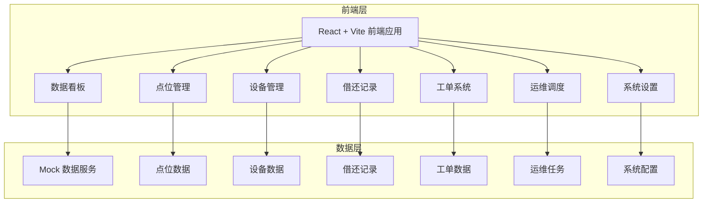
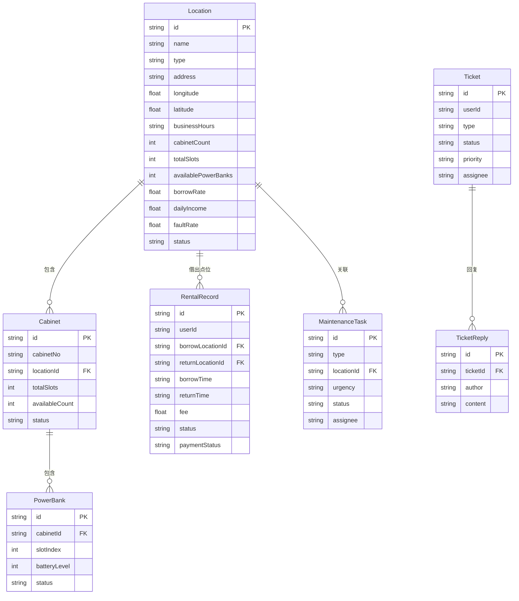

## 1. 架构设计



## 2. 技术说明

- 前端：React@18 + TypeScript + TailwindCSS@3 + Vite
- 初始化工具：Vite
- 状态管理：Zustand
- 路由：React Router v6
- 图表库：Recharts
- 后端：无（使用 Mock 数据模拟接口）
- 数据库：无（前端本地 Mock 数据）

## 3. 路由定义

| 路由 | 用途 |
|------|------|
| / | 重定向到 /dashboard |
| /dashboard | 数据看板：核心运营指标、趋势图表、点位排名 |
| /locations | 点位管理：点位列表、新增/编辑点位 |
| /locations/:id | 点位详情：点位信息、关联设备、借还统计 |
| /devices | 设备管理：设备列表、充电宝监控 |
| /devices/:id | 设备详情：槽位状态、借还记录 |
| /rentals | 借还记录：记录列表、计费明细 |
| /maintenance | 运维调度：补货/回收任务、任务看板 |
| /tickets | 工单系统：工单列表、工单详情 |
| /settings | 系统设置：计费规则、阈值设置、账户管理 |

## 4. API 定义（Mock）

### 4.1 点位相关

```typescript
interface Location {
  id: string;
  name: string;
  type: "mall" | "restaurant" | "scenic" | "hotel" | "transport" | "other";
  address: string;
  longitude: number;
  latitude: number;
  businessHours: string;
  cabinetCount: number;
  totalSlots: number;
  availablePowerBanks: number;
  borrowRate: number;
  dailyIncome: number;
  faultRate: number;
  status: "active" | "inactive" | "maintenance";
  createdAt: string;
}

type LocationListResponse = Location[];
type LocationDetailResponse = Location;
type CreateLocationRequest = Omit<Location, "id" | "borrowRate" | "dailyIncome" | "faultRate" | "createdAt">;
```

### 4.2 设备相关

```typescript
interface Cabinet {
  id: string;
  cabinetNo: string;
  locationId: string;
  locationName: string;
  totalSlots: number;
  availableCount: number;
  status: "online" | "offline" | "fault";
  powerBanks: PowerBank[];
  lastHeartbeat: string;
}

interface PowerBank {
  id: string;
  slotIndex: number;
  batteryLevel: number;
  status: "available" | "borrowed" | "charging" | "needs_recycle" | "fault";
  lastReportTime: string;
}
```

### 4.3 借还记录

```typescript
interface RentalRecord {
  id: string;
  userId: string;
  userName: string;
  userPhone: string;
  borrowLocationId: string;
  borrowLocationName: string;
  borrowTime: string;
  returnLocationId?: string;
  returnLocationName?: string;
  returnTime?: string;
  duration?: number;
  fee?: number;
  status: "borrowed" | "returned" | "overdue" | "abnormal";
  paymentStatus: "paid" | "unpaid" | "refunded";
}
```

### 4.4 运维任务

```typescript
interface MaintenanceTask {
  id: string;
  type: "restock" | "recycle" | "repair";
  locationId: string;
  locationName: string;
  locationAddress: string;
  cabinetId?: string;
  description: string;
  urgency: "high" | "medium" | "low";
  status: "pending" | "in_progress" | "completed";
  assignee?: string;
  createdAt: string;
  completedAt?: string;
}
```

### 4.5 工单

```typescript
interface Ticket {
  id: string;
  userId: string;
  userName: string;
  userPhone: string;
  type: "cannot_return" | "billing_error" | "device_fault" | "other";
  title: string;
  description: string;
  relatedRentalId?: string;
  status: "open" | "processing" | "resolved" | "closed";
  priority: "urgent" | "high" | "medium" | "low";
  assignee?: string;
  createdAt: string;
  updatedAt: string;
  replies: TicketReply[];
}

interface TicketReply {
  id: string;
  author: string;
  authorRole: "admin" | "operator" | "cs";
  content: string;
  createdAt: string;
  isInternal: boolean;
}
```

### 4.6 系统配置

```typescript
interface BillingRule {
  id: string;
  freeMinutes: number;
  pricePerHour: number;
  dailyCap: number;
  currency: string;
}

interface SystemThreshold {
  lowBatteryThreshold: number;
  lowStockThreshold: number;
  overdueReminderHours: number;
}

interface UserAccount {
  id: string;
  username: string;
  name: string;
  role: "admin" | "operator" | "cs";
  phone: string;
  status: "active" | "disabled";
  lastLoginAt: string;
  createdAt: string;
}
```

## 5. 服务器架构图

不适用（无后端服务，使用 Mock 数据）

## 6. 数据模型

### 6.1 数据模型定义



### 6.2 数据定义语言

使用前端 TypeScript 接口定义代替 DDL，Mock 数据以 JSON 格式存储在 `src/mocks/` 目录中。
